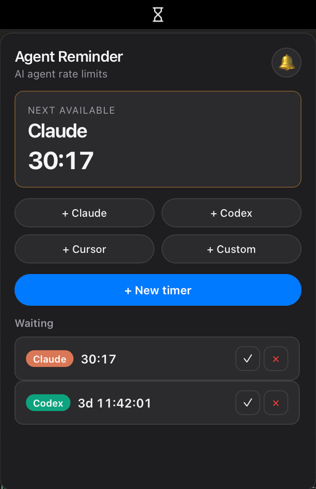

# Agent Reminder

**Не пропусти момент, когда агент снова доступен.**

Компактное приложение для menu bar / трея: отслеживает обратный отсчёт лимитов **Claude**, **Codex**, **Cursor** и любых других агентов. Поставил таймер — посмотрел на иконку — получил уведомление, когда лимит сбросился.

[English](README.md) · **Русский**



[**Скачать последний релиз →**](https://github.com/positron48/agent-reminder/releases)

macOS · Windows · Linux · Бесплатно, open source (MIT)

---

## Зачем это нужно

Упёрся в лимит — поставил таймер — вернулся к делам. Agent Reminder сидит в трее и подсказывает точный момент, когда можно снова писать в агента. Без арифметики в голове, без вкладок и таблиц.

- **Живой countdown** — ближайший свободный агент виден сразу
- **Умная иконка в трее** — ждём, скоро, или уже можно
- **Звук и уведомление** при сбросе лимита (можно выключить)
- **Не мешает** — на macOS без иконки в Dock, открывается из menu bar
- **Поверх fullscreen** на macOS — панель видна даже над полноэкранными приложениями
- **Таймеры сохраняются** после перезапуска

---

## Как пользоваться

1. **Поймал лимит** на Claude, Codex, Cursor или другом сервисе.
2. **Добавил таймер** — дни, часы, минуты, при желании комментарий.
3. **Получил сигнал**, когда можно продолжать.

Быстрые кнопки для популярных агентов. Одним кликом отметить «готов» или очистить список.

---

## Для разработчиков

```bash
npm install
npm run tauri:dev
```

Релизы собираются и публикуются автоматически по тегам версий. См. [`.github/workflows/release.yml`](.github/workflows/release.yml).

---

## Лицензия

MIT
